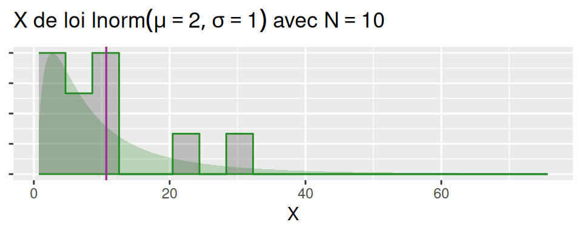
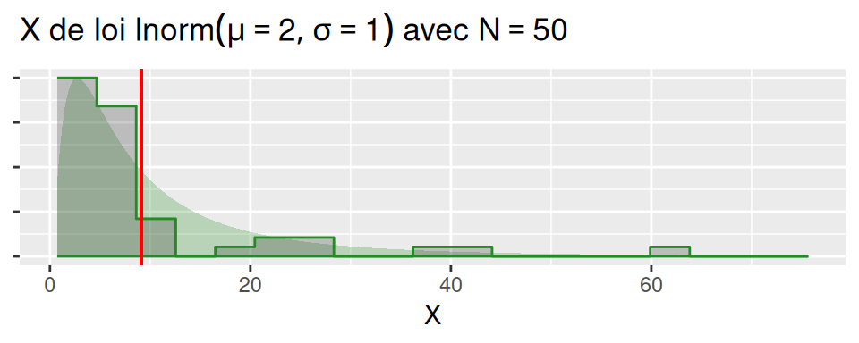
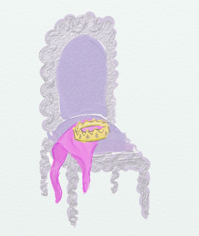

```{r setup, include=FALSE}
library(learnr)
library(gradethis)

Sys.setlocale("LC_ALL", "fr_FR.UTF-8")
gradethis_setup()
 
knitr::opts_chunk$set(echo = FALSE)

library(tidyverse)
library(gridExtra)
library(purrr)
library(magrittr)
library(gganimate)
library(infer)
source("scripts/utils2.R")
#knitr::opts_chunk$set(echo = TRUE, message=FALSE, warning=FALSE)

chateauxEtBoulots=read.csv("http://perso.ens-lyon.fr/lise.vaudor/grimoireStat/datasets/chateauxEtBoulots.csv",
                           header=TRUE, sep=",")
broceliande=read.csv("datasets/broceliande.csv",sep=";", header=T)
potions=read.csv("datasets/potions.csv",sep=";", header=T)
```

## 1. Introduction 


{width=400px}
Ce tutoriel est à la fois un **support de cours** et un **deck d'exercices** visant à expliquer les tests statistiques et leur mise en pratique sous R (notamment tests de Student et test du Chi-2). 

Les explications et données d'exemple pour ce tutoriel proviennent d'un ouvrage en ligne, **le Grimoire: Contes et stats R** <a href="http://perso.ens-lyon.fr/lise.vaudor/grimoireStat/_book/intro.html" target="_blank">disponible ici</a> (voir notamment le Chapitre 4 *Etablir le lien entre deux variables: tests d’hypothèse*). 

Vous pouvez également y trouver des chapitres portant sur d'**autres méthodes classiques en statistique** (description simple de variables, estimateurs, intervalles de confiance, modèles de **régression**, **analyse de la variance**, **modèle linéaire généralisé**).

## --- 1.1 Exercices de code

Ce document rassemble un certain nombre d'exercices, qui sont de **deux types**.

- Des exercices de type **QCM**.
- Des exercices de type **code**.

Dans ce deuxième type d'exercice, vous pourrez **modifier du code** dans une fenêtre (fond jaune pâle) qui est l'équivalent d'un **éditeur** (très simplifié) de code R. Pour **exécuter** les lignes de code, vous pouvez vous placer dessus et faire **Ctrl+Enter**. Le résultat s'affichera dans une fenêtre (fond rose pâle) en-dessous qui est l'équivalent d'une **console** R.

La consigne pour cet exercice d'exemple est la suivante:

Calculez le produit de a et b (qui ont été préalablement définis dans l'environnement).

```{r decouvre_exos-setup}
a=33
b=29
```

```{r decouvre_exos, exercise=TRUE}
produit=___
produit
```

```{r decouvre_exos-solution}
produit=a*b
produit
```

Dans ce tutoriel l'**environnement R est propre à chaque exercice**, et je le prépare pour qu'il contienne les **objets** (par exemple jeux de données) et les **packages**  nécessaires, installés et chargés.


## --- 1.2 Exercices type QCM

```{r usages_R}
question("Que venez-vous faire ici?",
        answer("comprendre les tests statistiques", correct=TRUE),
        answer("préparer mes prochaines vacances"),
        answer("mettre en oeuvre des tests statistiques avec R", correct=TRUE),
        answer("apprendre à faire de délicieuses lasagnes"),
        incorrect="Seules deux de ces propositions sont correctes",
        correct="Oui! C'est dommage pour le reste mais ce n'est pas de notre ressort aujourd'hui...",
        allow_retry=TRUE
)
```

## --- 1.3 Brocéliande

<table>
<col width="40%">
<col width="60%">
<tr><td>
</img>
</td>
<td>
Le jeu de données `broceliande` recense (en terme d'individus) un certain nombre d'arbres de la forêt de Brocéliande ainsi que (en terme de variables):
                                             
- `age`: leur âge, en années
- `espece`: leur espèce (chêne, châtaignier, hêtre ou sapin)
- `hauteur`: leur hauteur, en cm
- `largeur`: leur largeur, en cm
- `gui`: le nombre de touffes de gui qui les affecte
- `enchantement`: la présence d'un enchantement sur cet arbre (TRUE ou FALSE)
- `fees`: le nombre de fées qui habitent cet arbre
- `lutins`: le nombre de lutins qui habitent cet arbre
- `perlimpinpin`: la quantité de poudre de perlimpinpin dans sa sève (en $\mu$g/L)

</td></tr></table>

Le jeu de données `broceliande` est disponible en ligne [à cette adresse](datasets/broceliande.csv).

```{r broceliande_pres}
broceliande=read.csv("http://perso.ens-lyon.fr/lise.vaudor/grimoireStat/datasets/broceliande.csv",
                     header=TRUE,sep=";")
str(broceliande)
```

L'objectif des tests d'hypothèse est de déterminer si un **effet observé à l'échelle de l'échantillon** résulte d'un **effet réel à l'échelle de la population**, autrement dit, il s'agit de déterminer si l'effet observé est **significatif** et non pas simplement lié à l'**aléa d'échantillonnage**.


## --- 1.4 Châteaux et Boulots

<table>
  <col width="40%">
  <col width="60%">
<tr><td>
</img>
</td>
<td>
Le jeu de données `chateauxEtBoulots` recense (en terme d'individus) un certain nombre de personnes du pays Fantaisie ainsi que (en terme de variables)

- `activite`: leur activité (la royauté, la chevalerie, les enchantements ou la magie noire),
- `genre`: leur genre (féminin ou masculin),
- `region`: leur région (Bois-Jolis,Montage-Sombre ou Flots-Blancs)
- `tenue`: leur couleur de tenue (noire, grise, bleue, verte, ou rose).

</td>
</tr>
</table>
  
  
Le jeu de données `chateauxEtBoulots` est disponible en ligne [à cette adresse](datasets/chateauxEtBoulots.csv).

```{r chateauxEtBoulots_pres}
chateauxEtBoulots=read.csv("http://perso.ens-lyon.fr/lise.vaudor/grimoireStat/datasets/chateauxEtBoulots.csv",
                           header=TRUE, sep=",")
str(chateauxEtBoulots)
```


## 2. Test de Student 

Bien qu'il existe une multitude de tests d'hypothèses (test de Student, test du Chi-2, test de Mann-Whitney, etc. en fonction du type de données et de la problématique considérés), la l**ogique et les "mécanismes d'interprétation" sont toujours les mêmes**.

Je vais commencer par expliquer dans le détail les principes et les mécanismes sous-jacents à un test statistique, en développant l'exemple d'un test particulier, le **test de Student** ou **t-test**.


## --- 2.1 Principe

<div class="encadre">
Le **t-test** (ou **test de Student**) est conçu pour tester des **différences de moyennes entre deux groupes**.
</div>

<table>
<col width="20%">
<col width="80%">
<tr><td>
</img>
</td>
<td>

Par exemple, on cherche à caractériser la **quantité de poudre de perlimpinpin contenue par la sève d'un arbre** en fonction de la **nature enchantée ou non** de celui-ci. On peut commencer par décrire le lien entre ces deux variables à l'aide d'une table et d'une figure montrant les distributions de la variable `perlimpinpin` par groupe.
</td>
</tr>
</table>
  
Ci-dessous on calcule la moyenne et la médiane de quantité de perlimpinpin pour chacun des groupes, ainsi que l'écart-type par groupe et l'effectif (n).
 
```{r, echo=TRUE}
broceliande %>%
  group_by(enchantement) %>%
  summarise(moy=mean(perlimpinpin),
            med=median(perlimpinpin),
            sd=sd(perlimpinpin),
            n=n()) 
```  
  
On peut tracer les distributions à l'aide d'un graphique appelé "violinplot" (qui correspond, grosso modo, aux densités de probabilité représentées à la verticale).

  
```{r boxplot_ench_perl_2, fig.width=5, fig.height=3, echo=TRUE}
ggplot(broceliande, aes(x=enchantement, y=perlimpinpin))+
  geom_violin(fill="forestgreen", alpha=0.5)+
  geom_point(data=broceliande %>% group_by(enchantement) %>% summarise(perlimpinpin=mean(perlimpinpin)),
             shape=3,size=3,stroke=1)
```


A la vue du graphique et du tableau ci-dessus, on a bien l'impression que la quantité de perlimpinpin est plus importante pour les arbres enchantés que pour les autres, mais...


<!-- ```{r inference_mentale} -->
<!-- question("Est-ce un effet réel ou simplement dû au hasard, à votre avis? (plusieurs réponses possibles)", -->
<!--     answer("Probablement lié au hasard, car les distributions des deux groupes ne sont pas totalement disjointes."), -->
<!--     answer("Probablement lié au hasard, car les échantillons sont de tailles très inégales."), -->
<!--     answer("Probablement réel, car les tailles d'échantillon sont relativement importantes", correct=TRUE), -->
<!--     incorrect="Eh non, a priori les tailles d'échantillon iraient plutôt dans le sens d'un effet réel", -->
<!--     correct="Oui! Vu les tailles d'échantillon importantes et l'allure de la distribution par groupe, on peut penser que l'effet observé est réel.", -->
<!--     allow_retry=TRUE -->
<!-- ) -->
<!-- ``` -->

Avec la question ci-dessus, j'essaie de vous montrer que vous êtes capables de faire des **inférences "non-statistiques"**, qui font en fait appel à des notions de taille d'échantillon et de distribution des données qui sont fondamentales pour la réalisation de tests statistiques.

La réalisation de tests statistiques correspond à une **formalisation du raisonnement** que vous avez pu faire dans la question précédente, et qui permet de **quantifier** la probabilité que l'effet observé soit dû au hasard.

## --- 2.2 Formalisation

Je formalise mon problème par le modèle suivant:

<div class="encadre">
$perlimpinpin$ a une distribution $\mathcal{N}(\mu_e,\sigma_e)$ pour les
arbres enchantés, et $\mathcal{N}(\mu_f,\sigma_f)$ pour les autres.
</div>

On se place ici dans une formalisation du **t-test de Welch** (une variante plus robuste du test de Student "classique", puisqu'elle ne fait pas l'hypothèse que les variances sont égales dans les deux groupes). 

Je définis mon hypothèse:

<div class="encadre">
$H_0:\{\mu_e=\mu_f\}$
</div>

Selon cette hypothèse, il n'y a **pas de différence réelle** de moyenne entre les deux groupes (même si, de facto, il y a une différence *observée*).

Autrement dit, l'hypothèse que je cherche à tester statistiquement est celle selon laquelle "la quantité de perlimpinpin moyenne n'est pas différente selon les groupes" ...

alors que mon hypothèse au sens "scientifique" était plutôt l'hypothèse inverse puisque j'ai en réalité l'intention de prouver que l'enchantement **a un effet significatif sur la quantité de perlimpinpin**!... Il faut donc faire attention à ne pas se mélanger les pinceaux...

Considérons la statistique suivante:

<div class="encadre">

$$
T=\frac{\bar X_e-\bar X_f}{\sqrt{\frac{s_e^2}{n_e}+\frac{s_f^2}{n_f}}}=\frac{\bar X_e-\bar X_f}{\sqrt{eqm_e+eqm_f}}
$$
</div>

où

- $\bar{X_e}$ et $\bar{X_f}$ sont les estimateurs de la moyenne (par groupe)
- $s_e$ et $s_f$ sont les estimateurs des écarts-types (par groupe)
- $n_e$ et $n_f$ sont les effectifs observés (par groupe)

Cette métrique est donc d'autant plus grande (en valeur absolue) que

- l'écart entre moyennes est important,
- les tailles d'échantillons sont importantes,
- la variance au sein de chaque groupe est petite.

<div class="encadre">
Si notre hypothèse $H_0$ était vraie alors cette statistique $T$ devrait suivre une **distribution de Student** avec $\nu$ degrés de liberté.
</div>

(Il s'agit d'un résultat **mathématique**, que je ne démontrerai pas ici!)

Le **paramètre $\nu$** correspond à:

$$
\nu=\frac{\left(\frac{s_e^2}{n_e}+\frac{s_f^2}{n_f}\right)^2}{{(\frac{s_e^2}{n_e})}^2\frac{1}{n_e-1}+{(\frac{s_f^2}{n_f})}^2 \frac{1}{n_f-1}}=\frac{(eqm_e+eqm_f)^2}{eqm_e^2\ \frac{1}{n_e-1}+eqm_f^2\ \frac{1}{n_f-1}}
$$


On peut calculer les valeurs $t_{obs}$ (valeur de $T$ pour les observations) et $\nu$ "à la main":

```{r broc_ttest_calc_alamain, echo=TRUE}
broc_test=broceliande %>%
  group_by(enchantement) %>%
  summarise(m=mean(perlimpinpin),
            s2=sd(perlimpinpin)^2,
            n=n()) %>%
  mutate(eqm=s2/n,
         w=1/(n-1)) %>%
  mutate(eqmw=w*eqm^2)
valeurs_obs=broc_test %>%
  summarise(t_obs=diff(m)/sqrt(sum(eqm)),
            nu=sum(eqm)^2/sum(eqmw))
valeurs_obs
```

Voici la distribution de Student à $\nu$=`r round(valeurs_obs$nu)` degrés de liberté -i.e. **la distribution que $T$ doit suivre, théoriquement, si l'hypothèse $H_0$ est vraie**- et voilà (en rouge) comment se situe la **valeur observée de T pour notre échantillon ($t_{obs}$)**:

```{r broc_ttest_calc_infer_et_obs, echo=FALSE, fig.width=5, fig.height=2.5}
library(infer)
 mytest <- broceliande %>%
   t_test(formula = perlimpinpin ~ enchantement, order=c(TRUE,FALSE))

 model=broceliande %>%
   specify(perlimpinpin ~ enchantement) 
 theory=model %>%
   assume(distribution="t")
 stat= model %>% calculate(stat="t", order=c("TRUE","FALSE")) %>% pull(stat)
 
visualise(theory)+shade_p_value(stat,direction="greater") 
```

Comme on peut le voir sur ce graphique, la valeur que l'on observe pour T est très "excentrée" par rapport à la distribution théorique sous hypothèse $H_0$.

En effet, la **probabilité d'observer une valeur au moins aussi excentrée (à droite ou à gauche) sous hypothèse $H_0$**, ou **p-value** est de `r round(stat,2)`


C'est cette **valeur de probabilité** qui est représentée par la **surface coloriée en rose** dans le graphique ci-dessus.

Si la p-value est particulièrement petite, cela tend à prouver que **la valeur observée de $T$ est peu probable sous hypothèse $H_0$**. Cela amène donc à remettre en question l'hypothèse (et non l'observation!!).

<div class="encadre">En dessous d'un certain seuil pour cette probabilité (par exemple, $\alpha=5$\%), on décide de rejeter l'hypothèse $H_0$. Dans ce cas on peut affirmer qu'il existe bien un effet significatif de `enchantement` sur `perlimpinpin` 🪄.</div>

La valeur $\alpha$ est souvent, par convention, 5\% (il arrive aussi que l'on voie 10\%, 1\%, etc.). Cette valeur **n'est pas un repère absolu** (si vous êtes à 5.1\% plutôt qu'à 4.9\% ça ne devrait pas *fondamentalement* changer votre conclusion...).

```{r ttest_questions2}
question("Cochez les affirmations correctes",
         answer("La valeur de la statistique observée dépend des données", correct=TRUE),
         answer("La distribution de la statistique T sous hypothèse H0 est une distribution de Student et ne dépend pas des données"),
         answer("La p-value peut prendre des valeurs entre -1 et 1."),
         answer("Plus la p-value est proche de 0, plus il y a des chances que l'on rejette H0" , correct=TRUE),
         answer("Si la p-value est égale à 0.04, alors je peux rejeter H0 au seuil de 1% et conclure à un effet significatif"),
         answer ("Si la p-value est égale à 0.1, alors je peux rejeter H0 au seuil de 5% et conclure à un effet significatif"),
         incorrect="Attention il y a quelques petits pièges: la loi de Student a un paramètre (qui dépend bien des données), une p-value est une probabilité et ne peut pas être négative, et 0.04 correspond à 4% et 0.1 à 10%",
         correct="Oui! C'est une gymnastique mentale mais une fois que c'est intégré c'est comme le vélo...",
         allow_retry=TRUE
)
```

## --- 2.3 Erreurs

Quand on réalise un test d'hypothèse, on l'interprète généralement en fonction d'une valeur seuil $\alpha$.

Cette valeur seuil $\alpha$ abordée précédemment correspond en fait à un risque d'erreur de type I que l'on est "prêt à accepter".

<div class="encadre">
Faire une **erreur de type I**, ça consiste à **rejeter l'hypothèse nulle alors qu'elle est vraie** (c'est-à-dire, affirmer qu'une différence est significative alors que ce n'est pas le cas). Le **risque d'erreur de type I** est souvent noté $\alpha$

Faire une **erreur de type II**, au contraire, ça consiste à **ne pas rejeter l'hypothèse nulle alors qu'elle est fausse** (c'est-à-dire, ne pas conclure que la différence est significative alors qu'elle existe vraiment). Le **risque d'erreur de type II** est souvent noté $\beta$.
</div>


Cas            |   $H_0$ rejetée (🙂 "effet")| $H_0$ acceptée (😐 "pas d'effet")
---------------|-----------------------------|---------------
$H_0$ vraie (pas d'effet) | 🔴 erreur de type I ($\alpha$) | 🟢 CORRECT
$H_0$ fausse (effet)      | 🟢 CORRECT                     | 🔴 erreur de type II ($\beta$)

La **puissance d'un test** est égale à 1-$\beta$ i.e. elle correspond à la probabilité de détecter un effet quand il existe ($H_0$ est fausse et on rejette $H_0$).

Quand on choisit de réaliser un test avec un risque $\alpha$ particulièrement bas, alors le risque $\beta$ est particulièrement élevé, c'est à dire qu'on le fait au détriment de la **puissance** du test (c'est-à-dire que plus on minimise le risque de dire qu'il y a un effet alors qu'il n'y en a pas, plus on maximise le risque de "passer à côté" d'un effet qui existe).

```{r ttest_questions3}
question("Cochez les affirmations correctes",
          answer("Les tests statistiques permettent de ne jamais faire d'erreur d'interprétation"),
          answer("Quand on choisit le seuil alpha pour réaliser un test, on choisit en fait le risque d'erreur de type I", correct=TRUE),
          answer("beta=1-alpha"),
          answer("Généralement, on cherche à valider H0"),
          answer("Généralement, on cherche à 'prouver' qu'il existe un effet de X sur Y", correct=TRUE), 
          incorrect="Malheureusement, recourir à un test statistique ne nous prémunit pas de faire des erreurs d'interprétation et il faut toujours faire des compromis entre les risques d'erreur de type I et de type II",
          correct="Oui! Vous avez apparemment compris les grands principes donc on va pouvoir passer à la pratique :-)",
          allow_retry=TRUE)
```

## --- 2.4 Pratique

En pratique, pour réaliser un t-test sous R, on n'a pas besoin de faire à la main toutes les étapes du calcul de la statistique T et de $\nu$ détaillé précedemment (ouf!). Il existe *évidemment* des fonctions dans R pour faciliter la tâche.

La fonction de base est `t.test()`:

```{r myttest,type="essentiel", echo=TRUE}
mytest=t.test(perlimpinpin~enchantement, data=broceliande)
print(mytest)
```

Et voilà ⚡! comme vous pouvez le constater, cela prend plus longtemps d'expliquer le principe et l'interprétation d'un test de Student que de le réaliser avec R!


Plusieurs informations s'affichent:

- le **nom du test** (t-test de Welch pour deux échantillons)
- certains **éléments** qui interviennent dans le calcul d'une **p-value** (valeur de métrique observée t, nombre de degrés de liberté df)
- la **p-value** elle-même
- l'hypothèse alternative (et non pas $H_0$) selon laquelle la différence de moyenne entre les groupes **n'est pas** égale à 0
- un **intervalle de confiance à 95\% pour cette différence de moyenne**
- les **moyennes estimées** pour chaque groupe


On retrouve notamment la valeur $t_{obs}$, $\nu$ (nombre de degrés de liberté) et la p-value calculés "à la main" dans le paragraphe précédent, et qui nous permettent de **rejeter l'hypothèse H0** i.e. conclure que **l'enchantement de l'arbre a bien un effet sur la quantité de perlimpinpin qu'il produit**.


```{r ttest_exo1-setup}
library(dplyr)
library(ggplot2)
broceliande_chenes=read.csv("http://perso.ens-lyon.fr/lise.vaudor/grimoireStat/datasets/broceliande.csv",
                     header=TRUE,sep=";") %>%
  filter(espece=="chene")
```


<table>
  <col width="40%">
  <col width="60%">
  <tr><td>


Considérez à nouveau le jeu de données `broceliande`. Nous allons nous intéresser à la relation entre quantité de perlimpinpin et enchantement pour la sous-population des **chênes**.
  
Examinez les effectifs de chêne dans chaque groupe (arbres enchantés ou non) et réalisez le test qui permet de tester l'hypothèse $H_0$ selon laquelle **l'enchantement de l'arbre n'a pas d'effet sur la quantité de perlimpinpin qu'il produit**.

L'environnement ci-dessous est préparé de sorte que y sont disponibles:

- 💾 le jeu de données broceliande_chenes
- 📦 le package dplyr (chargé)
- 📦 le package ggplot2 (chargé)

</td><td>
```{r, echo=FALSE, fig.height=3, fig.width=3}
broceliande_chenes=read.csv("datasets/broceliande.csv",sep=";", header=T) %>% 
  filter(espece=="chene")
ggplot(broceliande_chenes,
       aes(x=enchantement, y=perlimpinpin))+geom_boxplot(fill="lightgreen")+ggtitle("Chênes")
```
</td></tr></table>


```{r ttest_exo1, exercise=TRUE}
# Examinez les effectifs
___(broceliande_chenes$enchantement)
# Réalisez le test
t.test(______~______, data=____)
```


```{r ttest_exo1-solution}
# Examinez les effectifs
table(broceliande_chenes$enchantement)
# Réalisez le test
t.test(perlimpinpin~enchantement, data=broceliande_chenes)
```

```{r ttest_questions1}
question("Le résultat du test ci-dessus permet de ",
         answer("rejeter l'hypothèse H_0: donc la quantité de perlimpinpin n'est pas liée à l'enchantement des chênes"),
         answer("accepter l'hypothèse H_0: donc la quantité de perlimpinpin n'est pas liée à l'enchantement des chênes"),
         answer("rejeter l'hypothèse H_0: donc la quantité de perlimpinpin est liée à l'enchantement des chênes", correct=TRUE),
         answer("accepter l'hypothèse H_0: donc la quantité de perlimpinpin est liée à l'enchantement des chênes"),
         incorrect="Non! attention au 'sens' de l'hypothèse H_0...",
         correct="Oui! Il était assez simple d'inférer cet effet ne serait-ce que visuellement -et du fait des effectifs importants de chênes-",
         allow_retry=TRUE
)
```


## --- 2.5 Pratique avec infer


<table><col width="20%"><col width="80%">
<tr>
<td>{width=200px}
</td><td>
Outre la fonction t.test de "base", il est également possible d'utiliser le package "infer" pour réaliser un t-test "à la tidyverse" (i.e. selon une syntaxe qui décompose les étapes du calcul/raisonnement)</td>
</td></tr></table>

Voici une manière de décomposer la réalisation d'un test:


<table><col width="60%"><col width="40%">
<tr><td>
```{r, fig.width=5, fig.height=5}
# Installer DiagrammeR si necessaire
if (!requireNamespace("DiagrammeR", quietly = TRUE)) {
  install.packages("DiagrammeR")
}

# Charger le package
library(DiagrammeR)

# Creer le diagramme
grViz('digraph infer_workflow {
  graph [layout = dot, rankdir = TB]

  # Definir les nœuds
  node [shape = rectangle, style = filled, color = lightblue]
  A [color="#bae1ff",label = "Données\n(tableau initial)"]
  B [color="#bae1ff", label = "Données + Modèle Y~X"]
  H [color="#ffb3ba",label = "p-value"]
  I [style=solid,color=black,label = "Rejet ou non de H0"]
  
  
  subgraph cluster_EF {
    label = "";
    style = filled;
    color = gray;
    node [shape = rectangle, style = filled, color = yellow];
  E [color="#ffdfba", label = "Distribution de la statistique\nsous hypothèse nulle"]
  F [color="#ffdfba", label = "Statistique observée"]
 
  }

  # Ajouter les connexions principales
  A -> B  [label = "specify()"]

  B -> E  [label = "assume()"]
  B -> F  [label = "calculate()"]
  F -> H
  E -> H  [label = "get_p_value()"]
  H -> I  [label = "Interpréter la p-value"]


}')

```
</td><td>

Ainsi, pour réaliser un test de Student avec `infer`, on suit les étapes suivantes:

- partant des <span style="background-color: #bae1ff; padding: 2px;">données</span>:
- spécifier ("specify") le <span style="background-color: #bae1ff; padding: 2px;">modèle</span> (données, variables X et Y) 
- en supposant ("assume") l'hypothèse nulle vraie, calculer la <span style="background-color: #ffdfba; padding: 2px;">distribution de la statistique</span>
- calculer ("calculate") la <span style="background-color: #ffdfba; padding: 2px;">statistique observée</span>
- obtenir la <span style="background-color: #ffb3ba; padding: 2px;">p-value</span> ("get_p_value") et l'interpréter

</td></tr></table>


```{r myttest_infer, echo=TRUE}
mod_et_hyp=broceliande %>%
  specify(perlimpinpin ~ enchantement) 
dist_null=mod_et_hyp %>%
  assume(distribution="t")
stat_obs=mod_et_hyp %>%
  calculate(stat="t", order=c("TRUE","FALSE")) %>%
  pull(stat)
p_value=get_p_value(dist_null,stat_obs, direction="greater")
p_value
```

<small> Remarque: on a ici une valeur de p-value très légèrement différente de celle qu'on obtenait avec la fonction `t.test`. La raison à cela est que `t.test` réalise par défaut un t-test de Welch et que la fonction `infer` réalise un t-test de Student classique. </small>
 
Enfin, on peut utiliser ces éléments pour **visualiser la distribution de la statistique de Student sous hypothèse nulle** et la **valeur de la statistique observée** (et ainsi visualiser la **p-value**).


```{r visualise_dist_null_et_pvalue, fig.width=5, fig.height=2.5, echo=TRUE}
visualize(dist_null)+
  shade_p_value(stat, direction="greater")
```
 
## 3. Validité du t-test 

Refaisons un pas en arrière... Jusqu'à présent j'ai supposé que les données permettaient de réaliser un test de Student. Mais qu'en est-il vraiment?        

Revenons aux conditions nécessaires à la validité du t-test.

Rappelez-vous comment j'ai spécifié mon modèle:

<div class="encadre">
$perlimpinpin$ a une distribution $\mathcal{N}(\mu_e,\sigma_e)$ pour les arbres enchantés, et $\mathcal{N}(\mu_f,\sigma_f)$ pour les autres.
</div>

Ainsi, on connaît la distribution de la statistique $T$ sous hypothèse $H_0$, mais aussi sous réserve que la distribution de $perlimpinpin$ dans chaque groupe défini par $enchantement$ soit **normale** (i.e. gaussienne).

## --- 3.1 Distribution normale / gaussienne

<table>
  <col width="60%">
  <col width="40%">
  <tr><td>
Une distribution normale ou gaussienne est une **distribution symétrique, centrée sur sa moyenne, et dont la forme est déterminée par son écart-type**. 
</td><td>

</td>
</tr></table>

Voici par exemple les distributions de deux variables générées selon une gaussienne (à gauche) et une loi non-gaussienne (à droite). 


```{r, fig.height=5, fig.width=8,echo=FALSE}
# Charger les packages nécessaires
library(patchwork)

# Générer des données
set.seed(123)
n <- 1000
data <- data.frame(
  variable = c(rnorm(n, mean = 0, sd = 1), rexp(n, rate = 1)),
  type = rep(c("Gaussienne", "Non-Gaussienne"), each = n)
)

# Graphique pour la densité de la variable gaussienne
plot_gaussian_density <- ggplot(data[data$type == "Gaussienne", ],
                                aes(x = variable)) +
  geom_density(fill = "skyblue", alpha = 0.5) +
  labs(title = "Densité gaussienne", x = "Valeur", y = "Densité") +
  theme_minimal()

# Graphique pour la densité de la variable non-gaussienne
plot_non_gaussian_density <- ggplot(data[data$type == "Non-Gaussienne", ],
                                    aes(x = variable)) +
  geom_density(fill = "coral", alpha = 0.5) +
  labs(title = "Densité non-gaussienne", x = "Valeur", y = "Densité") +
  theme_minimal()

# Graphique pour le boxplot de la variable gaussienne
plot_gaussian_boxplot <- ggplot(data[data$type == "Gaussienne", ], aes(x = type, y = variable)) +
  geom_boxplot(fill = "skyblue", alpha = 0.5) +
  labs(title = "Boxplot gaussien", x = "", y = "Valeur") +
  theme_minimal()

# Graphique pour le boxplot de la variable non-gaussienne
plot_non_gaussian_boxplot <- ggplot(data[data$type == "Non-Gaussienne", ], aes(x = type, y = variable)) +
  geom_boxplot(fill = "coral", alpha = 0.5) +
  labs(title = "Boxplot non-gaussien", x = "", y = "Valeur") +
  theme_minimal()

# Combiner les graphiques en une grille 2x2
combined_plot <- (plot_gaussian_density + plot_non_gaussian_density) / 
  (plot_gaussian_boxplot + plot_non_gaussian_boxplot)

# Afficher le graphique
print(combined_plot)
```

Examinez quelques exemples de situations ci-dessous où l'on essaie d'**évaluer visuellement** si la distribution de la variable à expliquer dans chacun des groupes peut être considérée comme **gaussienne ou non**.


```{r distribs_cases, fig.width=8, fig.height=5}
p1= ggplot(broceliande %>% filter(espece == "chene"),
           aes(x = enchantement, y = perlimpinpin)) +
  geom_boxplot(width=0.3)+
  geom_violin(fill="lightgreen", alpha=0.5)+
  labs(title = "a) perlimpinpin~enchantement (chênes)", x = "enchantement", y = "perlimpinpin") +
  theme_minimal()


p2= ggplot(broceliande %>% filter(espece == "sapin"),
           aes(x = enchantement, y = perlimpinpin)) +
  geom_boxplot(width=0.3)+
  geom_violin(fill="darkgreen", alpha=0.5)+
  labs(title = "b) perlimpinpin~enchantement (sapins)", x = "enchantement", y = "perlimpinpin") +
  theme_minimal()


p3= ggplot(broceliande,
           aes(x = as.factor(gui>0), y = hauteur)) +
  geom_boxplot(width=0.3)+
  geom_violin(fill="#70A9A9", alpha=0.5)+
  labs(title = "c) hauteur~gui", x = "présence-absence de gui", y = "hauteur de l'arbre") +
  theme_minimal()


p4= ggplot(broceliande,
           aes(x = enchantement, y = fees)) +
  geom_boxplot(width=0.3)+
  geom_violin(fill="#A03090", alpha=0.5)+
  labs(title = "d) fees~enchantement", x = "enchantement", y = "fees") +
  theme_minimal()

# Combiner les graphiques en une grille 2x2
combined_plot <- (p1+p2) /  (p3+p4)

# Afficher le graphique
print(combined_plot)
```


```{r question_gaussiennes}
question("Pour chaque situation ci-dessus, cochez si vous pensez que la distribution de la variable à expliquer dans chaque groupe est gaussienne ou non",
         answer("a) perlimpinpin~enchantement (chênes): gaussienne", correct=TRUE),
         answer("a) perlimpinpin~enchantement (chênes): non-gaussienne"),
         answer("b) perlimpinpin~enchantement (sapins): gaussienne"),
         answer("b) perlimpinpin~enchantement (sapins): non-gaussienne", correct=TRUE),
         answer("c) hauteur~gui: gaussienne"),
         answer("c) hauteur~gui: non-gaussienne", correct=TRUE),
         answer("d) fees~enchantement: gaussienne"),
         answer("d) fees~enchantement: non-gaussienne", correct=TRUE),
         incorrect="Hmm, ça se discute, mais je n'aurais pas dit cela...",
         correct="Bravo! Vous avez l'oeil pour repérer les distributions gaussiennes!",
         allow_retry=TRUE
)
```

## --- 3.2 Effectifs 

Que faire alors si l'on est dans un cas où manifestement la distribution par groupes n'est pas gaussienne?

<div class="encadre">
Dans certains cas, on peut considérer que les **effectifs par groupe sont assez élevés pour que la condition de distribution gaussienne ne soit pas strictement nécessaire à la validité du test**. En effet, la distribution de $T$ tend vers une distribution de Student à $\nu$ degrés de liberté asymptotiquement: si les tailles d'échantillon sont "suffisamment grandes" la distribution de la statistique sera proche de cette distribution théorique. Cela découle du **Théorème Central Limite** qui dit que la distribution de la moyenne d'un échantillon tend vers une gaussienne lorsque la taille de l'échantillon est grande.
</div>

<small>💡Souvent, on considère que s'il y a plus de 30 individus par groupe, alors on peut considérer que la distribution de $T$ est suffisamment proche d'une distribution de Student pour que le test soit valide ✅ ... mais il s'agit d'une règle empirique et non d'une règle mathématique! </small>

Cette idée de "distribution asymptotique" est assez compliquée à comprendre mathématiquement, mais nous pouvons ce genre de phénomène par une **simulation**... 


<!-- <table> -->
<!-- <col width="50%"> -->
<!-- <col width="50%"> -->
<!-- <tr><td> -->
<!-- On procède à plusieurs tirages de X, de taille $N=10$ (donc plutôt **petits**), dans une distribution non-gaussienne (distribution représentée en vert). Pour chacun de ces échantillons, on calcule la moyenne (droite violette). -->
<!-- </td><td> -->
<!-- ```{r dist1, echo=FALSE, fig.height=2, fig.width=5, cache=TRUE} -->
<!-- anim=distribution_of_mean(N=10, mu=2, sigma=1, -->
<!--                      nIter=10000,nImages=20, -->
<!--                      show=c(TRUE,TRUE,TRUE,FALSE), -->
<!--                      model="lnorm", -->
<!--                      animate=FALSE) -->
<!-- anim -->
<!-- ``` -->
<!-- </td></tr></table> -->
<!-- <table> -->
<!-- <col width="50%"> -->
<!-- <col width="50%"> -->
<!-- <tr><td> -->
<!-- On fait cela de très, très nombreuses fois (ici, 10 000 fois), et du coup on peut observer la distribution de moyennes afichée ci-contre... -->
<!-- </td><td> -->
<!-- ```{r anim1, echo=FALSE, fig.height=2, fig.width=5, cache=TRUE} -->
<!-- anim=distribution_of_mean(N=10, mu=2, sigma=1, -->
<!--                      nIter=10000,nImages=20, -->
<!--                      show=c(TRUE,TRUE,FALSE,FALSE), -->
<!--                      model="lnorm", -->
<!--                      animate=TRUE) -->
<!-- anim=anim+transition_states(frame,transition_length=1,state_length=1) -->
<!-- anim_save(animation=anim, filename="www/anim1.gif") -->
<!-- ``` -->
<!--  -->
<!-- </td></tr></table> -->

<!-- <table> -->
<!-- <col width="50%"> -->
<!-- <col width="50%"> -->
<!-- <tr><td> -->
<!-- Bon, ben, du coup, on ne sait pas très bien quelle loi suit la moyenne: (visiblement, une loi différente de la loi $\mathcal{N}(\mu,\sigma)$):  -->
<!-- blabal </td><td> -->
<!-- ```{r anim2, echo=FALSE, fig.height=2, fig.width=5} -->
<!-- distribution_of_mean(N=30, mu=5, sigma=1, -->
<!--                      nIter=10000,nImages=20, -->
<!--                      show=c(TRUE,FALSE,TRUE,TRUE), -->
<!--                      model="lnorm", -->
<!--                      animate=FALSE) -->
<!-- ``` -->
<!-- </td> -->
<!-- <td> -->


<!-- ```{r anim_lnorm_smallN_2, echo=FALSE, fig.height=2, fig.width=5} -->
<!-- distribution_of_mean(N=10, mu=2, sigma=1, -->
<!--                      nIter=10000,nImages=20, -->
<!--                      show=c(TRUE,FALSE,TRUE,TRUE), -->
<!--                      model="lnorm", -->
<!--                      animate=FALSE) -->
<!-- ``` -->
<!-- </td></tr></table> -->


<!-- Que se passe-t-il pour une taille d'échantillon plus importante? -->

<!-- ```{r anim5_bis, echo=FALSE, fig.height=2, fig.width=5, cache=TRUE} -->
<!-- anim=distribution_of_mean(N=50, mu=2, sigma=1, -->
<!--                      nIter=10000,nImages=20, -->
<!--                      show=c(TRUE,TRUE,FALSE,FALSE), -->
<!--                      model="lnorm") -->
<!-- anim=anim+transition_states(frame,transition_length=1,state_length=1) -->
<!-- anim_save(animation=anim, filename="anim3.gif") -->
<!-- ``` -->
<!--  -->
<!-- Par la barbe de Merlin! On dirait que plus **$N$ est grand**, et plus la distribution se **rapproche de la loi $\mathcal{N}(\mu,\sigma)$**! -->

<!-- ```{r anim6, echo=FALSE, fig.height=2, fig.width=5} -->
<!-- distribution_of_mean(N=50, mu=2, sigma=1, -->
<!--                      nIter=10000,nImages=20, -->
<!--                      show=c(TRUE,FALSE,TRUE,TRUE), -->
<!--                      model="lnorm", -->
<!--                      animate=FALSE) -->
<!-- ``` -->

<!-- Ce résultat, c'est ce qu'on appelle le **Théorème Central Limite**... Ce théorème stipule que "**pour N suffisamment grand**", la distribution de la moyenne $\bar X$ (moyenne d'une variable $X$ ayant une distribution **quelconque**, une **moyenne $\mu$** et un **écart-type $\sigma$**) est **$\mathcal{N}(\mu,\sigma/\sqrt{N})$**. -->


Que se passe-t-il si ce n'est pas le cas? (... et en l'occurrence, **ce n'est pas le cas**). Voyez plutôt, si l'on réaliste un test de Shapiro-Wilk pour tester la normalité des données (pour chaque groupe), ce test rejette l'hypothèse de distribution normale de perlimpinpin pour les arbres non-enchantés:

```{r shapiro}
perlimpinpin_enchantes=broceliande %>% filter(enchantement==TRUE) %>% pull(perlimpinpin)
perlimpinpin_nonenchantes=broceliande %>% filter(enchantement==FALSE) %>% pull(perlimpinpin)

shapiro.test(perlimpinpin_enchantes)
shapiro.test(perlimpinpin_nonenchantes)
```


En fait, comme dans le cas du **Théorème Central Limite**, quand bien même l'hypothèse de normalité des résidus ne serait pas respectée, la distribution de $T$ tend bien vers une distribution de Student à $\nu$ degrés de liberté **pour des tailles d'échantillon "suffisamment grandes"**.

Tout le sel de la situation consiste à estimer la valeur pour laquelle on estime que la taille d'échantillon est "suffisamment grande" (ce seuil étant d'autant plus élevé que la distribution des résidus est éloignée de la distribution normale) pour pouvoir appliquer le t-test quand bien-même l'hypothèse de normalité ne serait pas respecté...

Le package `infer` permet  de travailler assez facilement **non pas sur une distribution théorique de la statistique $T$** (reposant, donc, sur un modèle de distribution supposé) mais sur la **distribution observée de $T$ quand on réalise des permutations**.

Le principe des permutations réalisées ici est de réaliser de nombreuses fois l'opération suivante:

- étiqueter au hasard les individus selon les **modalités de la variable définissant les groupes** (et selon les effectifs observés)
- calculer la **statistique $T$** pour ce jeu de données (généré, donc, sous hypothèse que la variable qui définit le groupe et la réponse quantitative soient indépendants)

On obtient ainsi la **distribution de la statistique $T$ sous hypothèse d'indépendance** pour les distributions observées.

```{r infer_permutations_ttest, fig.width=5, fig.height=2.5}
# permutations=broceliande %>%
#   specify(perlimpinpin ~ enchantement) %>%
#   hypothesize(null="independence") %>%
#   generate(reps=1000,type="permute") %>%
#   calculate(stat="t", order=c(FALSE,TRUE)) %>%
#   visualize(method="simulation",
#             obs_stat=t_obs,
#             direction="two_sided")

```

Ici on constate que la significativité du résultat ne fait pas de doute!

## --- 3.3 infer

```{r}
# Installer DiagrammeR si necessaire
if (!requireNamespace("DiagrammeR", quietly = TRUE)) {
  install.packages("DiagrammeR")
}

# Charger le package
library(DiagrammeR)

# Creer le diagramme
grViz('digraph infer_workflow {
  graph [layout = dot, rankdir = TB]

  # Definir les nœuds
  node [shape = rectangle, style = filled, color = lightblue]
  A [color="#bae1ff",label = "Données\n(tableau initial)"]
  B [color="#bae1ff", label = "Données + Modèle Y~X"]
  C [color="#ffffb9", label = "Hypothèse nulle\nH0"]
  D [color="#ffffb9", label = "Données permutées"]
  H [color="#ffb3ba",label = "p-value"]
  I [style=solid,color=black,label = "Rejet ou non de H0"]
  
  
  subgraph cluster_EF {
    label = "";
    style = filled;
    color = gray;
    node [shape = rectangle, style = filled, color = yellow];
  E [color="#ffdfba", label = "Distribution de la statistique\nsous hypothèse nulle"]
  F [color="#ffdfba", label = "Statistique observée"]
 
  }

  # Ajouter les connexions principales
  A -> B  [label = "specify()"]

  B -> C  [label = "hypothesize()"]
  C -> D  [style = dashed, label = "generate()"]
  D -> E  [style = dashed, label="calculate()"]
 
  
  B -> F  [label = "calculate()"]
  F -> H
  E -> H  [label = "get_p_value()"]
  H -> I  [label = "Interpréter la p-value"]


}')

```


## 4. Test du Chi-2 


Révisons (suite à ce que l'on a vu sur le test de Student) le prrincipe général d'un test d'hypothèse *paramétrique*:

<div class="encadre">
- On considère un **modèle statistique** décrivant nos données
- On considère une certaine **hypothèse** $H_0$ concernant les paramètres du modèle
- On considère une **métrique $S$** (il s'agit d'une *variable aléatoire*), dont la nature dépend du test réalisé.
-  On calcule sa **distribution théorique** en se basant sur le modèle assorti de l'hypothèse $H_0$.
- On calcule la **valeur prise par $S$ pour les observations**: on obtient ainsi la mesure **$S_{obs}$**. $S_{obs}$ est une *réalisation* de la variable $S$.
- On regarde **où se place $S_{obs}$ par rapport à distribution théorique de $S$**: on calcule la probabilité que $S$ soit au moins aussi "extrême" que $S_{obs}$. C'est cette probabilité qui constitue la **p-value**.
</div>

Dans tous les cas, lorsque l'on réalise un test statistique, il faut être très attentif aux éléments suivants:

- Les hypothèses du modèle sous-jacent au test (par exemple, pour le t-test, la variable d'intérêt doit être de distribution gaussienne. En revanche, le fait que vous utilisiez le t-test de Welch et non de Student vous permet de supposer que la variance est différente dans les deux groupes)
- La nature de l'hypothèse $H_0$ (Si vous vous trompez sur la nature de cette hypothèse, alors vous vous tromperez dans la manière dont vous interprétez les résultats du test!)


## --- 4.1 Principe du test du Chi-2

Intéressons-nous au jeu de données `chateauxEtBoulots`, et au lien entre `genre` et `activite`.


```{r chateauxEtBoulots_barplot_1, fig.width=6,fig.height=2}
ggplot(chateauxEtBoulots,aes(x=activite))+
  geom_bar(aes(fill=genre))
```

```{r chateauxEtBoulots_barplot_2, fig.width=6,fig.height=2}
ggplot(chateauxEtBoulots,aes(x=activite))+
  geom_bar(aes(fill=genre),position="fill")
```


## --- 4.2 Tableau de contingence

Nous avons-vu que la comparaison entre le tableau des effectifs croisés **observés** et des effectifs **attendus** sous hypothèse d'indépendance pouvait nous renseigner sur un lien éventuel entre les deux variables considérées.

En l'occurrence, on peut noter les **effectifs observés** dans chacune des J cases du tableau $\bar {N_i}$ et les **effectifs attendus** $N_i$.

A partir de ces deux tableaux, une **statistique du Chi-2** (écrite $\chi^2$) peut être calculée et utilisée pour tester l'hypothèse d'indépendance entre les deux variables catégorielles. La statistique du $\chi^2$ correspond à :

$$\chi^2=\sum_{i=1}^{J}\frac{(\bar{N_i}-N_i)^2}{N_i}$$
**Sous hypothèse d'indépendance**, et sous réserve que les effectifs par case soient suffisamment importants, cette statistique $\chi^2$ est censée suivre une **distribution du $\chi^2$ à $J-2$ degrés de liberté**.

C'est ce résultat (mathématique) qui permet de fournir une **p-value** qui correspond à la **probabilité d'obtenir une valeur de $\chi^2$ supérieure à celle qui est calculée sur les observations**.

## --- 4.3 Pratique

Faire un test du Chi-2 sous R

<table>
  <col width="40%">
  <col width="60%">
  <tr>
  <td>
  <td>Examinons par exemple le jeu de données `chateauxEtBoulots` et plus particulièrement le lien entre le genre et l'activité de nos personnages de contes de fée... On sait grâce aux **tableaux de contingence** comment **décrire le lien** entre ces deux variables catégorielles par un **tableau de contingences**. Voyons maintenant comment l'on peut **tester la significativité de ce lien**.</td>
  </tr>
</table>

```{r chateauxEtBoulots_chisq_en_pratique}
montest=chisq.test(table(chateauxEtBoulots$genre,chateauxEtBoulots$activite))
print(montest)
```

Ici la p-value est très petite, montrant (comme on s'y attendait) que les deux variables **ne sont pas indépendantes**.

On peut examiner plus avant les éléments renvoyés par ce test de la manière suivante:

```{r chisqtest_elems}
names(montest)
```

On retrouve ainsi, entre autres choses, des éléments d'information concernant

- les **effectifs observés**


```{r chisqtest_observed}
montest$observed
```

- les **effectifs attendus sous hypothèse d'indépendance**

```{r chisqtest_expected}
montest$expected
```


<div class="exo">

Considérez le tableau `chateauxEtBoulots` et les variables `tenue` et `region`. Les tendances en terme de couleurs de tenue sont-elles bien significativement différentes en fonction de la région de Fantaisie?...

```{r, echo=FALSE, results=FALSE}
chisq.test(table(chateauxEtBoulots$tenue,chateauxEtBoulots$region))
```

</div>


## 5 Validité du test du Chi-2 

## ----- 5.1 Petits effectifs

Un test du $\chi^2$ est construit en supposant que **les effectifs $\bar N_j$ sont "suffisants")**. Ainsi, quand certaines cases du tableau de contingence comprennent trop peu d'individus, appliquer un test du $\chi^2$ peut causer un "warning" stipulant que *l'approximation du $\chi^2$ peut être incorrecte*.

Conidérons par exemple un sous-jeu de données de `chateauxEtBoulots` rassemblant uniquement les individus de noble extraction, et intéressons-nous au lien entre leur genre et leur couleur de tenue:

```{r chateauxEtBoulots_princiere}
tenue_princiere=filter(chateauxEtBoulots, activite=="royaute") %>%
  mutate(tenue=as.factor(as.vector(tenue)))

table_tenue_princiere=table(tenue_princiere$genre, tenue_princiere$tenue)
table_tenue_princiere


chisq.test(table_tenue_princiere)
```

Ici, on a bien des effectifs réduits qui causent le renvoi d'un warning...

Le package `infer` permet, dans ce genre de situation, de **calculer une p-value en passant par des permutations** plutôt qu'en utilisant la distribution de la statistique du $\chi^2$ qui s'applique pour des effectifs observés importants.

Le principe des permutations réalisées ici est de réaliser de nombreuses fois l'opération suivante:

- étiqueter au hasard les individus selon les **modalités du premier facteur** (et selon les effectifs observés pour celui-ci)
- étiqueter au hasard les individus selon les **modalités du second facteur** (et selon les effectifs observés pour celui-ci)
- calculer la **statistique du $chi^2$** pour ce jeu de données (généré, donc, sous hypothèse que les deux facteurs soient indépendants)

On obtient ainsi la **distribution de la statistique $chi^2$ sous hypothèse d'indépendance** pour les effectifs observés de l'un et l'autre facteur (aussi déséquilibrés et faibles soient-ils).

La valeur observée du $\chi^2$ sur les données est la suivante:

```{r infer_obs_chisq, warning=FALSE, message=FALSE}
obs_chisq=tenue_princiere %>%
  chisq_test(formula=tenue~genre) %>%
  select(statistic) %>%
  pull()

obs_chisq # pareil que chisq.test(tenue_princiere)$statistic, mais obtenu via infer

```

On simule 1000 jeux de données différents à partir du jeu de données `sim_princiere` selon la méthode expliquée ci-dessus. On obtient ainsi 1000 valeurs de la statistique $\chi^2$:

```{r infer_generate_chisq}
sim_princiere=tenue_princiere %>%
  specify(tenue~genre) %>%
  hypothesize(null="independence") %>%
  generate(reps=1000, type="permute") %>%
  calculate(stat="Chisq")

head(sim_princiere)
```

Cela permet de décrire la distribution de la statistique $\chi^2$ et d'en déduire une p-value:

```{r sim_princiere_visu, fig.width=5, fig.height=2.5}
# resume_sim_princiere=
#   sim_princiere %>%
#   mutate(case=stat<obs_chisq) %>%
#   group_by(case) %>%
#   summarise(prop=n()) %>%
#   mutate(prop=prop/1000)
# resume_sim_princiere
# 
# sim_princiere%>%
#   visualize(obs_stat=obs_chisq, direction="greater")
```

On obtient ainsi la distribution réelle de la statistique du $\chi^2$ sous hypothèse d'indépendance, et la valeur de la p-value . Ici, on remarque que la p-value est quasiment inchangée selon la méthode de calcul (distribution théorique ou par permutations)! On n'est pas en mesure d'affirmer que la couleur de tenue des princes et princesses dépend de leur genre.


<div class="exo">

On reprend l'exercice précédent...

Considérez le tableau `chateauxEtBoulots` et les variables `tenue` et `region`. Les tendances en terme de couleurs de tenue sont-elles bien significativement différentes en fonction de la région de Fantaisie?...

Répondez à cette question à l'aide du package `infer` et des permutations, de sorte de ne pas être gêné par le faible effectif dans certaines cases du tableau de contingence...

```{r, echo=FALSE, results=FALSE}
# obs_chisq=tenue_princiere %>%
#   chisq_test(formula=tenue~region) %>%
#   select(statistic) %>%
#   pull()
# 
# obs_chisq # pareil que chisq.test(tenue_princiere)$statistic, mais obtenu via infer
# sim_princiere=tenue_princiere %>%
#   specify(tenue~genre) %>%
#   hypothesize(null="independence") %>%
#   generate(reps=1000, type="permute") %>%
#   calculate(stat="Chisq")
# 
# head(sim_princiere)
# resume_sim_princiere=
#   sim_princiere %>%
#   mutate(case=stat<obs_chisq) %>%
#   group_by(case) %>%
#   summarise(prop=n()) %>%
#   mutate(prop=prop/1000)
# resume_sim_princiere
# 
# sim_princiere%>%
#   visualize(obs_stat=obs_chisq, direction="greater")
```

</div>


## ANNEXE

```{r}
# Installer DiagrammeR si necessaire
if (!requireNamespace("DiagrammeR", quietly = TRUE)) {
  install.packages("DiagrammeR")
}

# Charger le package
library(DiagrammeR)

# Creer le diagramme
grViz('digraph infer_workflow {
  graph [layout = dot, rankdir = TB]

  # Definir les nœuds
  node [shape = rectangle, style = filled, color = lightblue]

  C [color="orange", label = "Hypothèse nulle\nH0"]
  D [color="orange", label = "Données permutées"]
  G [label = "Graphique \nde la distribution sous H0\nde la statistique observée"]
  H [label = "p-value"]
  I [color = seagreen,label = "Interprétation :\nRejeter ou non H0"]


  subgraph cluster_AB {
    label = "";
    style = solid;
    color = gray;
    node [shape = rectangle, style = filled, color = pink];
    A [label = "Données\n(tableau initial)"]
    B [label = "Données + Modèle Y~X"]
  }
  
  subgraph cluster_EF {
    label = "";
    style = solid;
    color = gray;
    node [shape = rectangle, style = filled, color = yellow];
 E [color="yellow", label = "Distribution de la statistique\nsous hypothèse nulle"]
  F [color="yellow", label = "Statistique observée"]
 
  }

  # Ajouter les connexions principales
  A -> B  [label = "<B>specify()</B> : Spécifier le modèle"]
  B -> C  [label = "hypothesize(): Formuler l hypothèse nulle"]
  C -> D  [style = dashed, label = "generate() : Générer les données sous H0 (permutation/bootstrap)"]
  D -> E  [style = dashed, label="Calculer la distribution de la statistique sous H0"]
 
  B -> E  [label = "assume(): calculer la distribution de la statistique sous H0,\nen supposant les conditions de validité remplies"]
  E -> H  [label = "calculate(): calculer la statistique observée"]
  F -> H
  B -> F  [label = "calculate()"]
  E -> G  [label = "calculate()\nCalculer la statistique"]
  G -> H [label = "visualize()\nVisualiser la distribution de la statistique sous hypothèse nulle."]
  H -> I  [label = "get_p_value()\nEstimer la p-value"]


}')

```

